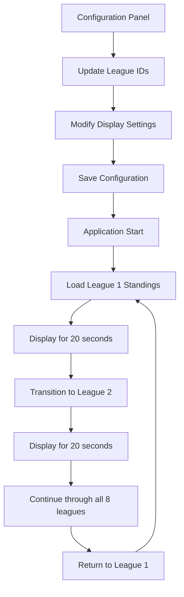

# Fantasy Football League Standings Display - Product Requirements Document

## 1. Product Overview
A single-page web application that displays fantasy football league standings from 8 different leagues using the Sleeper API, designed for continuous display on 32-inch TV screens at a local sports bar.

The application automatically rotates through each league's standings every 20 seconds, providing an engaging visual experience for patrons to track their fantasy football performance in real-time.

## 2. Core Features

### 2.1 User Roles
No user authentication required - this is a public display application.

### 2.2 Feature Module
Our fantasy football standings display consists of the following main components:
1. **Main Display Page**: League standings table, auto-rotation timer, league identifier header
2. **Configuration Interface**: League ID management, rotation timing controls, display settings

### 2.3 Page Details

| Page Name | Module Name | Feature description |
|-----------|-------------|---------------------|
| Main Display | League Standings Table | Display current standings with team names, wins, losses, points for, points against, and win percentage |
| Main Display | Auto-Rotation System | Automatically cycle through 8 different leagues every 20 seconds with smooth transitions |
| Main Display | League Header | Show current league name and week information prominently at the top |
| Main Display | Visual Indicators | Display loading states, connection status, and rotation progress |
| Configuration | League Management | Input and store 8 Sleeper league IDs for data retrieval |
| Configuration | Display Settings | Adjust rotation timing, enable/disable specific leagues, and customize visual appearance |

## 3. Core Process

**Main Display Flow:**
The application loads with the first league's standings, displays for 20 seconds, then transitions to the next league. After showing all 8 leagues, it returns to the first league and repeats the cycle continuously.

**Configuration Flow:**
Administrators can access a configuration panel to update league IDs, modify rotation timing, and adjust display preferences.

## 4. User Interface Design

### 4.1 Design Style
- **Primary Colors**: Deep navy blue (#1a365d) and bright green (#38a169) for sports theme
- **Secondary Colors**: White (#ffffff) for text, light gray (#f7fafc) for backgrounds
- **Button Style**: Rounded corners with subtle shadows for modern appearance
- **Font**: Bold, sans-serif fonts (Roboto or similar) with large sizes for TV readability
- **Layout Style**: Full-screen table layout with prominent headers and clear data separation
- **Icons**: Football and trophy emojis (🏈🏆) for visual appeal

### 4.2 Page Design Overview

| Page Name | Module Name | UI Elements |
|-----------|-------------|-------------|
| Main Display | League Header | Large title with league name, current week, and football emoji. Navy background with white text, 48px font size |
| Main Display | Standings Table | Clean table with alternating row colors, team logos, bold team names, and right-aligned statistics. 32px font for readability |
| Main Display | Rotation Indicator | Progress bar or dots showing current league position in rotation cycle |
| Main Display | Status Bar | Small footer showing connection status and last update time |
| Configuration | Settings Panel | Simple form with input fields for league IDs, sliders for timing, and toggle switches for options |

### 4.3 Responsiveness
Designed specifically for 32-inch TV displays (1920x1080 resolution). The interface uses large fonts and high contrast colors optimized for viewing from across a room. No mobile responsiveness required as this is a dedicated TV display application.