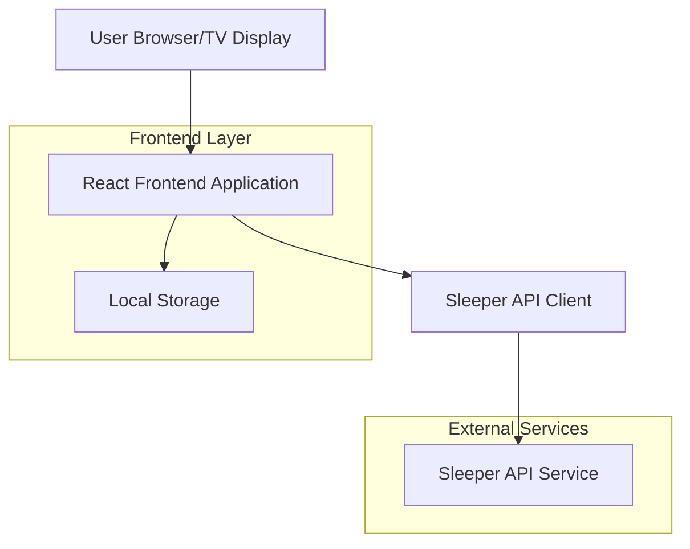
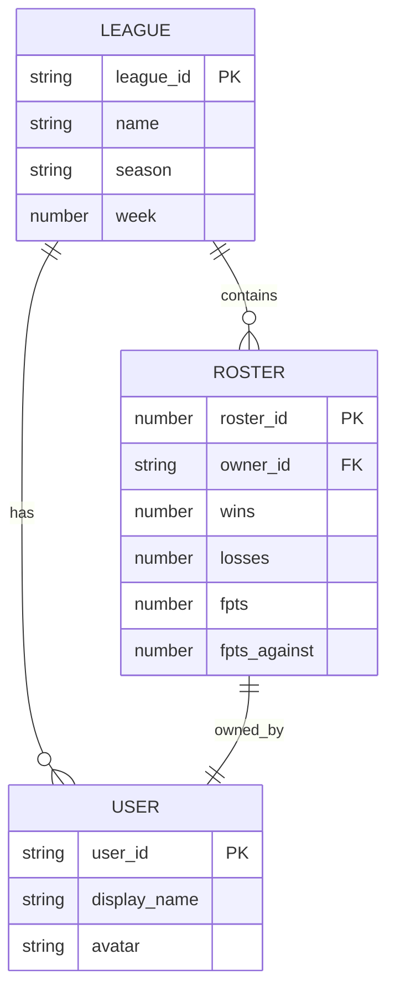

# Fantasy Football League Standings - Technical Architecture Document

## 1. Architecture Design



## 2. Technology Description

* Frontend: React\@18 + TypeScript + Vite + TailwindCSS\@3

* API Integration: Axios for HTTP requests to Sleeper API

* State Management: React Context API + useReducer

* Styling: TailwindCSS with custom TV-optimized components

* Build Tool: Vite for fast development and optimized builds

## 3. Route Definitions

| Route   | Purpose                                                        |
| ------- | -------------------------------------------------------------- |
| /       | Main display page showing rotating league standings            |
| /config | Configuration panel for setting league IDs and display options |

## 4. API Definitions

### 4.1 Sleeper API Integration

**Get League Information**

```
GET https://api.sleeper.app/v1/league/{league_id}
```

Response:

| Param Name | Param Type | Description                      |
| ---------- | ---------- | -------------------------------- |
| league\_id | string     | Unique identifier for the league |
| name       | string     | League name                      |
| season     | string     | Current season year              |
| week       | number     | Current week number              |

**Get League Rosters**

```
GET https://api.sleeper.app/v1/league/{league_id}/rosters
```

Response:

| Param Name    | Param Type | Description                         |
| ------------- | ---------- | ----------------------------------- |
| roster\_id    | number     | Unique roster identifier            |
| owner\_id     | string     | User ID of team owner               |
| wins          | number     | Number of wins                      |
| losses        | number     | Number of losses                    |
| fpts          | number     | Total fantasy points scored         |
| fpts\_against | number     | Total fantasy points scored against |

**Get League Users**

```
GET https://api.sleeper.app/v1/league/{league_id}/users
```

Response:

| Param Name    | Param Type | Description            |
| ------------- | ---------- | ---------------------- |
| user\_id      | string     | Unique user identifier |
| display\_name | string     | Team/user display name |
| avatar        | string     | Avatar image ID        |

### 4.2 Data Processing Types

```typescript
interface League {
  league_id: string;
  name: string;
  season: string;
  week: number;
}

interface TeamStanding {
  roster_id: number;
  team_name: string;
  wins: number;
  losses: number;
  points_for: number;
  points_against: number;
  win_percentage: number;
}

interface LeagueStandings {
  league: League;
  standings: TeamStanding[];
}
```

## 5. Data Model

### 5.1 Data Model Definition



### 5.2 Local Storage Schema

The application uses browser localStorage to persist configuration:

```javascript
// Configuration stored in localStorage
const config = {
  leagueIds: [
    "league_id_1",
    "league_id_2",
    "league_id_3",
    "league_id_4",
    "league_id_5",
    "league_id_6",
    "league_id_7",
    "league_id_8"
  ],
  rotationInterval: 20000, // 20 seconds in milliseconds
  enabledLeagues: [true, true, true, true, true, true, true, true],
  displaySettings: {
    showLogos: true,
    animationSpeed: 500,
    theme: "sports"
  }
};

// Store configuration
localStorage.setItem('fantasy-standings-config', JSON.stringify(config));
```

## 6. Implementation Guidelines

### 6.1 Component Structure

```
src/
├── components/
│   ├── StandingsTable.tsx
│   ├── LeagueHeader.tsx
│   ├── RotationIndicator.tsx
│   ├── ConfigPanel.tsx
│   └── LoadingSpinner.tsx
├── hooks/
│   ├── useSleeperAPI.ts
│   ├── useRotation.ts
│   └── useLocalStorage.ts
├── services/
│   └── sleeperAPI.ts
├── types/
│   └── index.ts
└── App.tsx
```

### 6.2 Key Implementation Notes

1. **API Rate Limiting**: Sleeper API has rate limits. Implement caching and avoid excessive requests.
2. **Error Handling**: Display fallback content when API calls fail or leagues are unavailable.
3. **Performance**: Use React.memo for components and useMemo for expensive calculations.
4. **TV Optimization**: Use large fonts (minimum 24px), high contrast colors, and avoid small interactive elements.
5. **Auto-rotation**: Implement using useEffect with setInterval, ensuring cleanup on component unmount.

### 6.3 Deployment Considerations

* Build static files using `npm run build`

* Deploy to any static hosting service (Netlify, Vercel, GitHub Pages)

* Ensure HTTPS for API calls to work properly

* Configure for full-screen display on TV browsers

* Set up auto-refresh or error recovery for long-running displays

